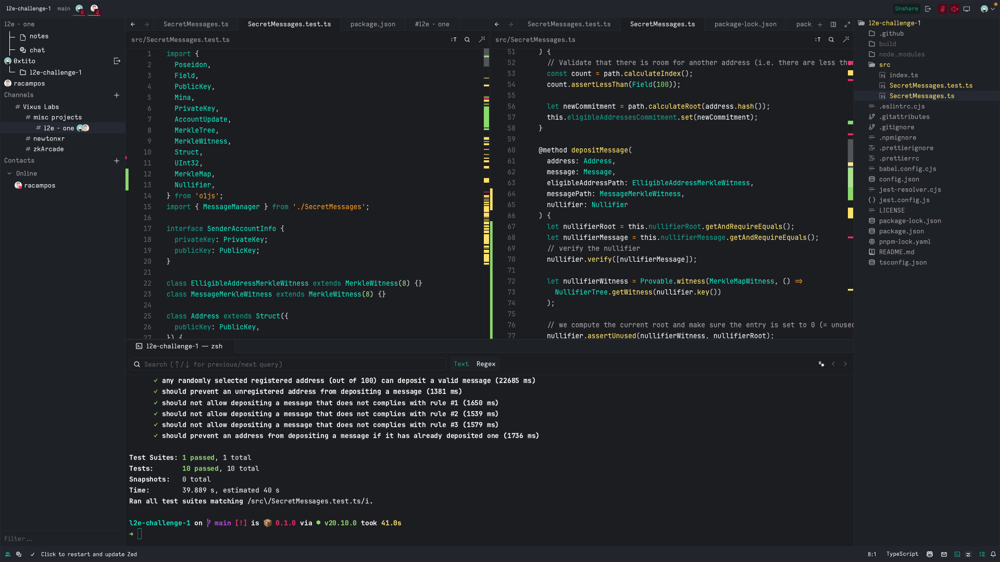

# Learn to Earn Challenge #1

## Introduction

Welcome to the "Learn to Earn Challenge #1" project! This project is a collaboration between me, Rafael Campos (racampos) and Tito Thompson (0xtito), developed using the innovative Zed IDE which allows for real-time, online collaboration.


## Installation

To get started with "Learn to Earn Challenge 1", follow these steps:

1. Clone the repository:

```sh
git clone https://github.com/racampos/l2e-challenge-1.git
```

2. Navigate to the project directory:

```sh
cd learn-to-earn-challenge-1
```

3. Install dependencies:

```sh
pnpm install
```


## Usage

Run the tests

```sh
pnpm test
```

## How We Worked Together

Using the Zed IDE, we were able to collaborate in real-time, which significantly enhanced our workflow and efficiency. Our collaboration process involved:

- Pair programming sessions
- Regular code reviews
- Real-time debugging and problem-solving

Here is a screenshot of how the Zed IDE looks like:




© 2024 racampos and 0xtito

